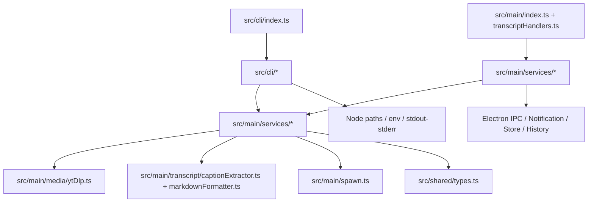

# Flucto CLI Mode Design

## Goal

Add a first-class `flucto` CLI for AI agents and automation while keeping the current Electron + TypeScript + yt-dlp/ffmpeg stack. The CLI must not launch the desktop app, must not import Electron IPC entrypoints, and must reuse the same downloader/transcript behavior through a shared Node service layer.

## Current Evidence

- `package.json` is ESM (`"type": "module"`) and currently has no `bin` entry or CLI script; all scripts target Vite/Electron build, packaging, lint, and tests (`package.json:17-49`).
- `postinstall` already runs `scripts/setup-binaries.mjs`, which downloads `yt-dlp` and `ffmpeg` into local `bin/` (`package.json:46`, `scripts/setup-binaries.mjs:7-23`, `scripts/setup-binaries.mjs:61-147`).
- Desktop download logic is concentrated in `src/main/index.ts` IPC handlers and currently imports Electron app/window/dialog/notification APIs at module top level (`src/main/index.ts:1-15`).
- Download format quality helpers are private inside `src/main/index.ts`, including video quality selector, audio quality selector, Instagram override behavior, and resolved video selector (`src/main/index.ts:51-115`).
- Metadata/format/download IPC handlers call `yt-dlp` through `getBinaryPath`, `getCommonYtDlpArgs`, `getRefererForUrl`, and `execa` (`src/main/index.ts:338-497`, `src/main/index.ts:708-1058`).
- Batch download parsing currently ignores blank lines and lines beginning with `#`, `;`, or `]` (`src/main/index.ts:808-842`).
- Shared DTOs already model CLI-relevant contracts: `MediaOutputMode`, `DownloadRequest`, `DownloadProgress`, `TranscriptSettings`, `TranscriptRequest`, `TranscriptMarkdownResponse`, and `TranscriptProgress` (`src/shared/types.ts:11-68`, `src/shared/types.ts:81-136`, `src/shared/types.ts:176-198`).
- `src/main/media/ytDlp.ts` is the strongest reusable media helper seam: platform headers/referers, JSON parsing, and `runYtDlpJson` are already isolated (`src/main/media/ytDlp.ts:6-157`).
- `src/main/spawn.ts` wraps Node subprocess execution and exposes stream-capable child processes, so progress parsing can be reused without Electron.
- `src/main/utils.ts#getBinaryPath` is Electron-coupled through `app.isPackaged`, `app.getAppPath()`, and `process.resourcesPath` (`src/main/utils.ts:1-24`).
- `src/main/config.ts` is Electron-coupled through `app.getPath('userData')` and `app.getPath('downloads')` (`src/main/config.ts:1-19`).
- `src/main/store.ts` and `src/main/historyStore.ts` use `electron-store`, so importing them from CLI would implicitly choose desktop-flavored persistence (`src/main/store.ts:1-55`, `src/main/historyStore.ts:1-28`).
- Transcript conversion orchestration exists in `src/main/transcript/transcriptHandlers.ts` but is private and coupled to `ipcMain`, Electron clipboard, `Electron.WebContents`, `settingsStore`, and history writes (`src/main/transcript/transcriptHandlers.ts:1-12`, `src/main/transcript/transcriptHandlers.ts:73-186`, `src/main/transcript/transcriptHandlers.ts:208-230`).
- Transcript extraction and Markdown formatting are mostly reusable: `captionExtractor.ts` exposes language resolution, caption parsing, language listing, and `extractTranscript` (`src/main/transcript/captionExtractor.ts:82-350`); `markdownFormatter.ts` is pure formatting/filename code (`src/main/transcript/markdownFormatter.ts:14-149`).
- Electron packaging currently includes `dist-electron/**/*`, `dist/**/*`, `package.json`, and extra `bin/**/*` resources for desktop installers (`electron-builder.json5:11-25`).

## Design Principles

1. **One engine, two adapters.** Desktop IPC and CLI should call the same media/transcript service functions.
2. **No Electron import in CLI execution path.** CLI modules must not import `src/main/index.ts`, `src/main/handlers.ts`, `src/main/transcript/transcriptHandlers.ts`, `src/main/config.ts`, `src/main/utils.ts`, `src/main/store.ts`, or `src/main/historyStore.ts` until those modules are split or adapted.
3. **Automation-friendly output.** Human progress goes to stderr; final machine-readable output can be emitted as JSON to stdout.
4. **Boring TypeScript.** Use current ESM/TypeScript build; use Node's built-in argument parsing or a tiny parser first. Add `commander`/`yargs` only if implementation proves painful.
5. **Safe defaults.** Default download directory for CLI should be explicit and deterministic: `--output-dir`, then `FLUCTO_OUTPUT_DIR`, then `process.cwd()`. Avoid silently writing to Electron's downloads path.

## Architecture Decision

### Chosen Architecture: Extract shared Node service layer + thin adapters



### Why this option

- It preserves the stack and current binaries.
- It avoids duplicate CLI-only yt-dlp behavior.
- It reduces the existing divergence between `download-video`, `download-single`, and `download-multiple` in `src/main/index.ts`.
- It creates a testable unit boundary for both desktop and CLI.

### Alternatives rejected

1. **Call existing IPC handlers from CLI.** Rejected because importing `src/main/index.ts` registers Electron lifecycle/IPC and requires Electron at module load (`src/main/index.ts:1-15`).
2. **Create a separate CLI downloader implementation.** Rejected because platform-specific yt-dlp headers and retry logic already exist (`src/main/media/ytDlp.ts:20-105`, `src/main/index.ts:729-790`, `src/main/index.ts:917-1057`); duplicating them would drift.
3. **Embed a headless Electron app for CLI.** Rejected because it still requires desktop runtime semantics and contradicts the goal: no desktop app launch for AI-agent automation.

## Proposed File Structure

```text
src/
  cli/
    index.ts                  # executable entrypoint, shebang, command routing
    args.ts                   # parse/validate CLI args
    output.ts                 # human/json renderers, exit codes
  main/
    services/
      binaryResolver.ts       # Electron-free resolver + desktop adapter factory
      paths.ts                # Electron-free CLI/default path helpers
      mediaDownload.ts        # shared download runner and progress parser
      mediaInfo.ts            # shared info/playlist/formats service
      transcriptMarkdown.ts   # shared transcript conversion runner
      batch.ts                # URL list parsing and concurrency helper
      settingsDefaults.ts     # pure defaults/validators extracted from store.ts
    adapters/
      desktopDownloadAdapter.ts     # optional: desktop notification/history/progress glue
      desktopTranscriptAdapter.ts   # optional: desktop clipboard/history/progress glue
```

Notes:

- `src/main/services/*` may import Node APIs, `src/main/spawn.ts`, `src/main/media/ytDlp.ts`, transcript modules, and shared types.
- `src/cli/*` may import service modules and shared types only.
- Electron-specific adapter modules may import Electron, `store.ts`, `historyStore.ts`, `config.ts`, and `utils.ts`.

## Service Contracts

### Binary resolver

```ts
export interface BinaryResolver {
  ytDlpPath: string;
  ffmpegPath: string;
}

export interface BinaryResolverOptions {
  binDir?: string;
  ytDlpPath?: string;
  ffmpegPath?: string;
}
```

Resolution order for CLI:

1. `--yt-dlp` / `--ffmpeg`
2. `FLUCTO_YT_DLP_PATH` / `FLUCTO_FFMPEG_PATH`
3. `--bin-dir`
4. repo/package `bin/`
5. `PATH` fallback (`yt-dlp`, `ffmpeg`) only if local files are absent

Desktop keeps current packaged behavior through a separate adapter that mirrors `src/main/utils.ts:6-24`.

### Media download runner

```ts
export interface MediaDownloadOptions {
  url: string;
  format: 'mp4' | 'mp3';
  outputDir: string;
  quality: DownloadQualityPreferences;
  formatOverrides?: { videoFormatId: string | null; audioFormatId: string | null };
  requestId?: string;
  title?: string;
  noPlaylist?: boolean;
}

export interface MediaDownloadDeps {
  binaries: BinaryResolver;
  onProgress?: (progress: DownloadProgress) => void;
  now?: () => number;
}
```

Required behavior:

- Build args from the current `download-single` behavior because it is the richest path: `--newline`, platform args, `--ffmpeg-location`, quality/override selection, stdout progress parsing, history-ready result (`src/main/index.ts:902-1058`).
- Move format selector helpers out of `src/main/index.ts:51-115` into reusable service code.
- Preserve Twitter/X retry fallback currently used in download handlers (`src/main/index.ts:747-790`, `src/main/index.ts:923-1057`).
- Return concrete file paths when known; preserve output template as fallback only when yt-dlp does not report final path.

### Media info service

Functions:

```ts
getMediaInfo(url, deps): Promise<VideoInfo>
getPlaylistInfo(url, deps): Promise<VideoInfo[]>
getAvailableFormats(url, deps): Promise<FormatOption[]>
```

Implementation:

- Extract existing logic from `get-video-info`, `get-playlist-info`, and `get-available-formats` (`src/main/index.ts:251-497`).
- Keep `getCommonYtDlpArgs`, `getRefererForUrl`, and JSON parsing from `src/main/media/ytDlp.ts:6-157`.

### Transcript Markdown service

```ts
export interface TranscriptMarkdownOptions {
  request: TranscriptRequest;
  outputDir?: string;
  saveFile?: boolean;
  copyToClipboard?: boolean; // desktop adapter only
}

export interface TranscriptMarkdownDeps {
  binaries: BinaryResolver;
  onProgress?: (progress: TranscriptProgress) => void;
  writeClipboard?: (markdown: string) => void;
}
```

Required behavior:

- Extract `normalizeTranscriptSettings`, `wordCount`, `saveMarkdown`, `convertOne`, and `runWithConcurrency` from `src/main/transcript/transcriptHandlers.ts:21-205` into a service that accepts callbacks/deps instead of `Electron.WebContents`.
- Reuse `extractTranscript` and `listCaptionLanguages` from `src/main/transcript/captionExtractor.ts:247-350` after injecting or refactoring binary resolution.
- Reuse `formatTranscriptMarkdown` and `sanitizeMarkdownFilename` from `src/main/transcript/markdownFormatter.ts:116-149`.
- For CLI, default `copyToClipboard=false`; desktop can keep clipboard behavior through an injected `writeClipboard` adapter.

## CLI UX

### Commands

```bash
flucto download <url> [--format mp4|mp3] [--quality 1080p|720p|...] [--audio-quality 320kbps|...] [--output-dir DIR] [--json]
flucto batch <file> [--format mp4|mp3|md] [--concurrency N] [--output-dir DIR] [--json]
flucto transcript <url> [--language en|ko|ja|zh|auto] [--timestamps] [--no-timestamps] [--metadata] [--no-metadata] [--stdout] [--output-dir DIR] [--json]
flucto info <url> [--json]
flucto formats <url> [--json]
flucto languages <url> [--json]
flucto doctor [--json]
flucto --version
flucto --help
```

### Output rules

- Default human mode:
  - Progress/status to stderr.
  - Final saved file path or summary to stdout.
- `--json`:
  - Final result JSON to stdout.
  - Progress events as newline-delimited JSON to stderr only if `--progress-json` is set.
- `transcript --stdout`:
  - Markdown body to stdout.
  - Errors/progress to stderr.
  - Cannot combine `--stdout` with human progress on stdout.

### Exit codes

```text
0 success
1 invalid arguments
2 invalid URL
3 missing binary
4 upstream/yt-dlp failure
5 transcript unavailable
6 file write failure
7 partial batch failure
```

## Batch Mode

- Input parser should match current desktop batch-file behavior: trim lines, drop blank lines, drop comments starting with `#`, `;`, or `]` (`src/main/index.ts:808-842`).
- `batch --format md` should call transcript conversion for each URL.
- `batch --format mp4|mp3` should call media download runner.
- Default concurrency:
  - downloads: `2`
  - transcripts: current transcript batch concurrency is `2` (`src/main/transcript/transcriptHandlers.ts:14-15`)
- `--json` batch result should include per-item success/error records and return exit code `7` if any item fails.

## Packaging / Distribution

### Development and source checkout

Add package scripts:

```json
{
  "build:cli": "tsc -p tsconfig.electron.json",
  "cli": "node dist-electron/cli/index.js"
}
```

Because `tsconfig.electron.json` currently includes `src/main/**/*`, `src/preload/**/*`, and `src/shared/**/*` (`tsconfig.electron.json`), implementation must add `src/cli/**/*` to the include list.

### Package bin

Add a package bin entry after the CLI file exists:

```json
{
  "bin": {
    "flucto": "./dist-electron/cli/index.js"
  }
}
```

The entrypoint must begin with:

```ts
#!/usr/bin/env node
```

### Release artifacts

Two stages:

1. **Internal/dev CLI first:** source checkout + `npm install` + `npm run build:electron` + `node dist-electron/cli/index.js`.
2. **Standalone CLI artifact later:** produce `flucto-cli-${platform}-${arch}.zip` containing:
   - `dist-electron/cli/**/*`
   - `dist-electron/main/services/**/*`
   - required shared/main helper modules
   - `package.json`
   - `bin/yt-dlp`, `bin/ffmpeg`

Do not block the first implementation on standalone packaging. AI-agent automation can use source checkout CLI first.

## Implementation Plan

### Phase 1 — Make Electron-free foundations

1. Extract settings defaults/validators from `src/main/store.ts` into `src/main/services/settingsDefaults.ts`; keep `store.ts` as an Electron-store adapter.
2. Add `src/main/services/binaryResolver.ts` with CLI-safe binary resolution and a desktop-compatible adapter.
3. Modify `src/main/media/ytDlp.ts` and `src/main/transcript/captionExtractor.ts` to accept injected binary paths/resolvers instead of hard-importing Electron-aware `getBinaryPath` where needed.
4. Add focused tests for resolver order and settings defaults.

Acceptance:

- Importing `src/cli/index.ts` in Node does not import `electron`.
- Existing desktop tests still pass.
- `captionExtractor` tests still pass.

### Phase 2 — Extract media services

1. Move `getVideoFormatSelector`, `getAudioQualityValue`, `isInstagramUrl`, `getOverrideVideoFormatSelector`, and `getResolvedVideoFormatSelector` out of `src/main/index.ts:51-115`.
2. Extract `getMediaInfo`, `getPlaylistInfo`, and `getAvailableFormats` from `src/main/index.ts:251-497`.
3. Extract `runMediaDownload` from the `download-single` path (`src/main/index.ts:902-1058`) and make `download-video`/`download-multiple` use it.
4. Keep desktop progress by adapting `onProgress` to `event.sender.send('download-progress', ...)`.

Acceptance:

- Desktop `download-single`, `download-multiple`, `get-video-info`, `get-playlist-info`, and `get-available-formats` behavior remains equivalent.
- Unit tests cover arg construction for mp4/mp3 quality, Instagram override suppression, and Twitter/X retry args.

### Phase 3 — Extract transcript service

1. Move `normalizeTranscriptSettings`, `wordCount`, `saveMarkdown`, `runWithConcurrency`, and conversion orchestration from `src/main/transcript/transcriptHandlers.ts:21-205` into `src/main/services/transcriptMarkdown.ts`.
2. Keep `transcriptHandlers.ts` as a thin IPC adapter: load store settings, pass callbacks, write clipboard/history.
3. Add CLI-safe `saveMarkdown` output-dir support.

Acceptance:

- Existing transcript tests pass.
- New tests cover `language: auto`, `language: en`, `--stdout` no-file behavior, duplicate filename suffixing, and batch partial failure.

### Phase 4 — Add CLI entrypoint

1. Add `src/cli/index.ts`, `src/cli/args.ts`, and `src/cli/output.ts`.
2. Implement commands: `download`, `batch`, `transcript`, `info`, `formats`, `languages`, `doctor`, `--help`, `--version`.
3. Add `package.json` scripts and `bin` entry.
4. Add `src/cli/**/*` to `tsconfig.electron.json` include.

Acceptance:

- `node dist-electron/cli/index.js --help` prints commands and exits 0.
- `node dist-electron/cli/index.js doctor --json` reports binary presence/version without Electron.
- `node dist-electron/cli/index.js transcript <fixture-or-mocked-url> --json` returns `TranscriptMarkdownResponse` shape.

### Phase 5 — Documentation and release path

1. Update README CLI section after implementation.
2. Document agent-friendly examples:
   - save transcript Markdown
   - emit Markdown to stdout
   - batch convert URLs
   - JSON output parsing
3. Decide whether to add standalone CLI release artifacts after source-checkout CLI is proven.

Acceptance:

- README examples match actual commands.
- Release workflow remains unchanged unless standalone CLI artifacts are intentionally added.

## Test Plan

### Unit tests

- CLI args parser: command validation, required URL/file, incompatible flags, defaults.
- Binary resolver: explicit flags, env vars, bin-dir, local bin, PATH fallback, missing binary error.
- Media arg builder: mp4 quality selector, mp3 quality selector, ffmpeg path, platform args, Instagram override suppression, Twitter/X retry mode.
- Progress parser: percent/speed/ETA line, no ETA line, merger output path.
- Batch parser: comments/blank lines matching desktop parser.
- Transcript service: settings normalization, `auto` language behavior, word count, duplicate Markdown filename allocation.

### Integration tests

- Stub `yt-dlp` and `ffmpeg` executables in a temp `bin/` and verify CLI commands construct expected args.
- Run `doctor --json` against temp binaries.
- Run `transcript --stdout` with mocked extraction result or stubbed caption file flow.
- Verify no CLI test imports `electron` by using the existing electron stub only for desktop tests and a separate pure Node CLI test path.

### Manual smoke tests

```bash
npm run build:electron
node dist-electron/cli/index.js --help
node dist-electron/cli/index.js doctor --json
node dist-electron/cli/index.js info 'https://www.youtube.com/watch?v=...' --json
node dist-electron/cli/index.js transcript 'https://www.youtube.com/watch?v=...' --language en --stdout > transcript.md
node dist-electron/cli/index.js download 'https://www.youtube.com/watch?v=...' --format mp3 --output-dir /tmp/flucto-smoke
```

## Risks and Mitigations

| Risk | Evidence | Mitigation |
|---|---|---|
| CLI accidentally imports Electron | Electron imports are top-level in `src/main/index.ts:1-15`, `src/main/config.ts:1-19`, `src/main/utils.ts:1-24`, and `transcriptHandlers.ts:1-12` | Add service modules with no Electron imports; add a test that imports CLI in plain Node. |
| Binary resolution differs by runtime | Current resolver depends on Electron app paths (`src/main/utils.ts:6-24`) | Inject binary resolver into services; keep desktop resolver separate from CLI resolver. |
| Download behavior drifts | Download args are duplicated across handlers (`src/main/index.ts:499-806`, `src/main/index.ts:902-1058`) | Standardize on one service runner and make IPC handlers thin. |
| CLI returns template path instead of real file | Existing single download only partially parses final file path (`src/main/index.ts:981-1028`) | Improve final-path detection in shared service; document fallback. |
| Settings/history side effects surprise automation | Store/history use `electron-store` (`src/main/store.ts:39-55`, `src/main/historyStore.ts:8-18`) | CLI defaults should be stateless unless `--config`/`--history` is introduced later. |
| Clipboard behavior is desktop-only | `clipboard.writeText` is used inside transcript handler (`src/main/transcript/transcriptHandlers.ts:118-120`) | Disable clipboard in CLI v1; add only via explicit future dependency if needed. |
| Standalone artifact scope grows | Electron builder currently packages desktop resources, not CLI artifacts (`electron-builder.json5:11-25`) | Ship source-checkout CLI first; add release artifact as separate phase. |

## Acceptance Criteria

1. `npm run build:electron` emits a runnable `dist-electron/cli/index.js`.
2. `node dist-electron/cli/index.js --help` exits 0 and does not initialize Electron.
3. `doctor --json` verifies `yt-dlp` and `ffmpeg` using CLI resolver.
4. `info`, `formats`, `languages`, `download`, `batch`, and `transcript` commands call shared services, not IPC handlers.
5. Desktop UI continues to use the same services through IPC adapters.
6. CLI supports machine-readable final output with `--json`.
7. CLI sends human progress to stderr, not stdout.
8. Transcript `--stdout` emits only Markdown to stdout.
9. Tests cover parser, resolver, arg builder, transcript conversion, and IPC/service parity.
10. README examples are added only after commands exist and are verified.

## Follow-up Staffing Guidance

If implementing this plan with parallel agents:

- **Service extractor**: owns `src/main/services/*`, media arg builders, resolver, and desktop adapter seams.
- **CLI implementer**: owns `src/cli/*`, package scripts/bin entry, output and exit-code behavior.
- **Tester**: owns CLI parser/resolver/service tests and transcript/download stub integration tests.
- **Reviewer**: checks Electron import boundaries and desktop behavior parity.

Recommended execution lane: Team + Ultragoal. Team can parallelize service extraction, CLI UX, and tests; Ultragoal should track durable acceptance evidence across phases.
