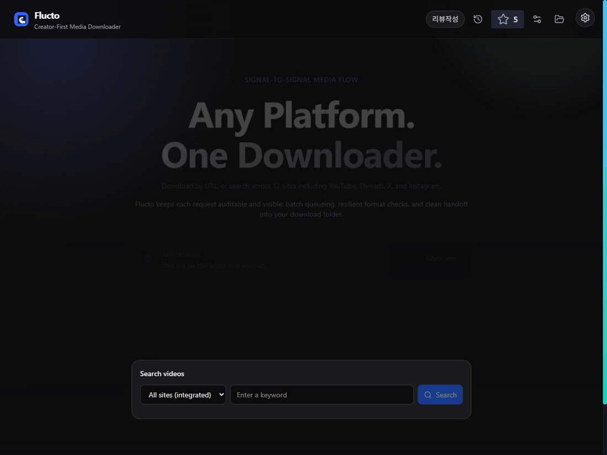
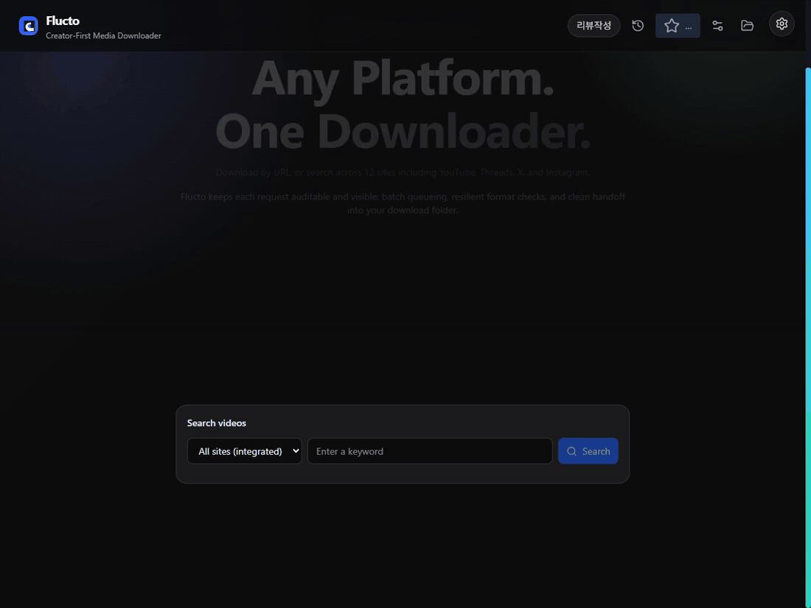
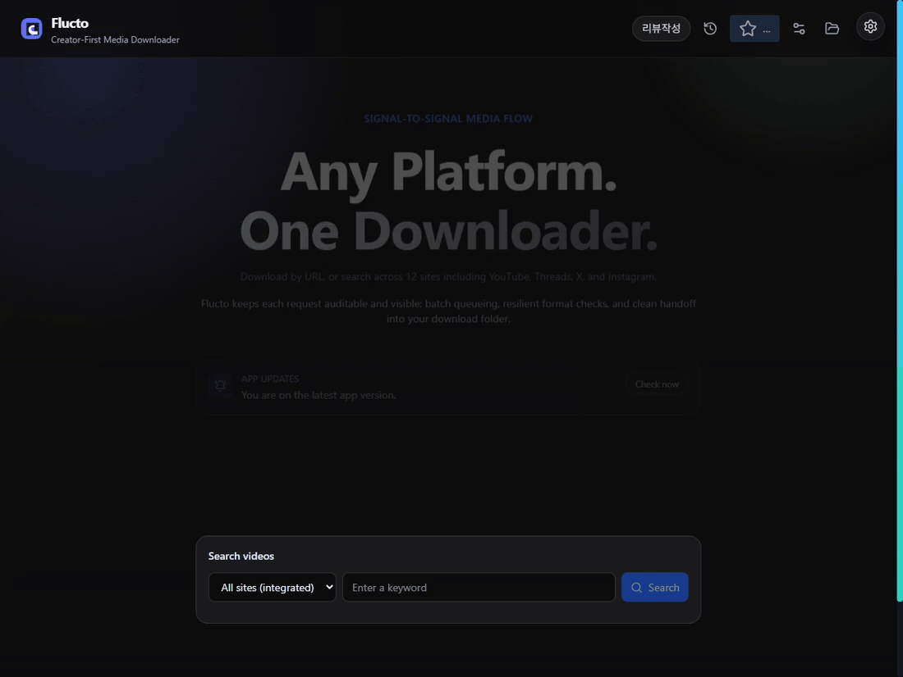
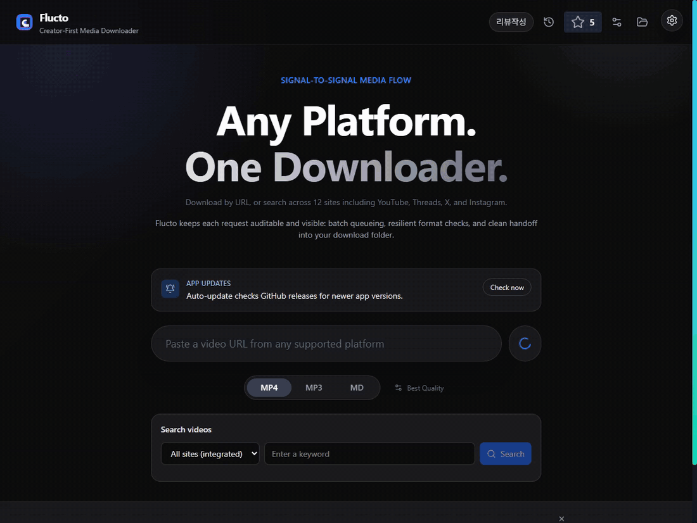
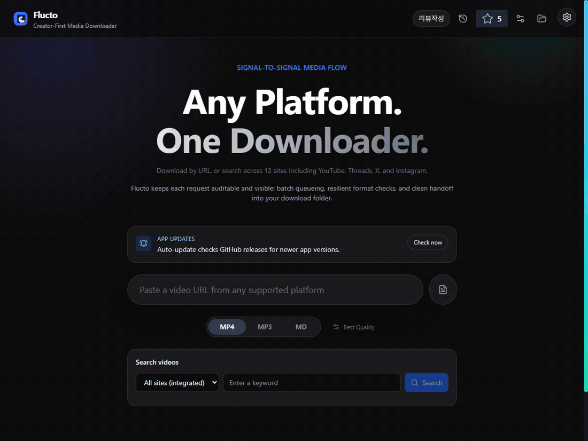
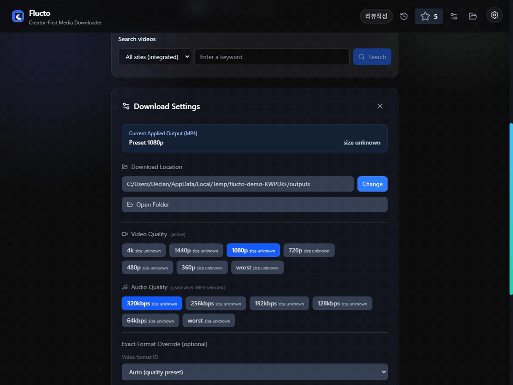
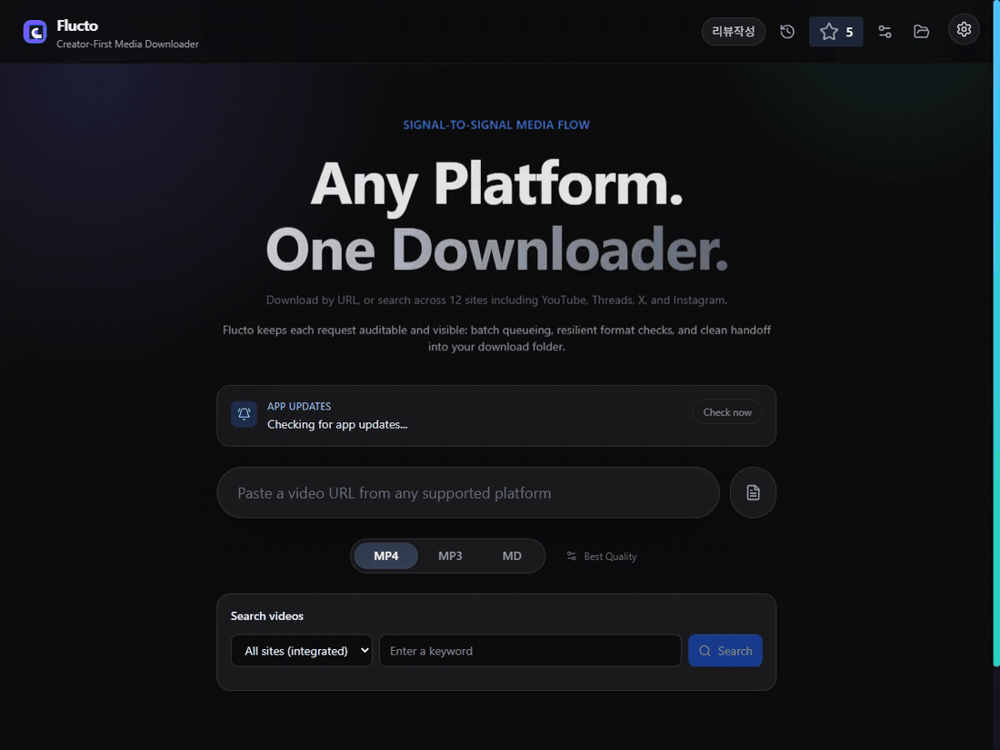
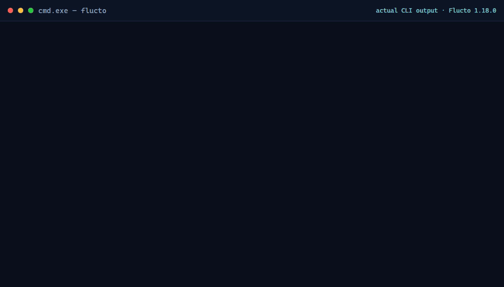
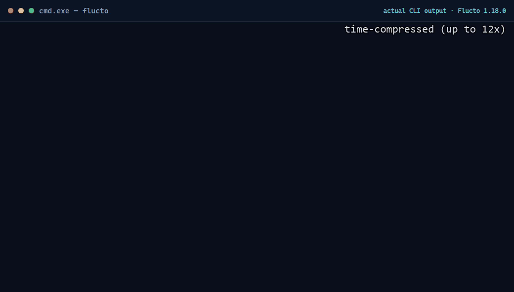

# 🌊 Flucto

<p align="center">
  Flucto - prepare reference video, audio tracks and caption notes for your AI video workflow. Desktop app + CLI.
</p>

<p align="center">
  <a href="https://github.com/DeclanJeon/flucto/releases"></a>
  <a href="#"></a>
  <a href="https://github.com/DeclanJeon/flucto"></a>
  <a href="https://www.typescriptlang.org/"></a>
</p>

<p align="center">
  
</p>


> Flucto is a source-available source-preparation tool for creators: search references, save permitted media as MP4/MP3, and turn available captions into Markdown notes. It does not generate or edit video. Continue with your editor or generation tool after collection.

- **Desktop + CLI:** Use the visual queue or automate the same media service with `flucto` / `fl`.
- **12 registered search sites:** Search together or choose one source; access, sessions, format availability and caption support vary by site and video.
- 📝 **Caption to Markdown**: Convert available subtitles/captions into clean `.md` files with metadata and timestamps
- 📦 **Batch Processing**: Import `.txt` lists to download media or convert caption queues automatically
- ⚡ **Auto-Setup**: Automatically fetches and configures `yt-dlp` and `ffmpeg` binaries
- 🔒 **Anonymous Search Sessions**: Media processing stays local; keyword searches contact site APIs/public indexes without reusing your logged-in browser profile
- 🎵 **Format Choice**: Save video (MP4), audio extraction (MP3), or Markdown transcript output
- **Typed core:** Desktop and CLI share TypeScript media services.

<p align="center">
  
</p>

<p align="center"><a href="https://flucto.ponslink.com">Interactive demos & installation</a> · <a href="#real-feature-demos">All 12 feature demos</a> · <a href="https://github.com/DeclanJeon/flucto/releases/latest">Latest release</a></p>

- [Report Bug](https://github.com/DeclanJeon/flucto/issues)

## Key Features

- **Smart Media Engine:** Flucto parses single video, playlist, and social-media URLs while sharing platform-specific `yt-dlp` headers, referers, and retry behavior across preview, download, and transcript flows.
- **Integrated Video Search:** Search all 12 registered sites together or select one site, see native/index source attribution and partial failures, then add results to the existing MP4/MP3 download queue. Desktop and CLI share the same service.
- **Extensible Platform Architecture:** Plugin-based `PlatformAdapter` system — adding a new platform is one file. Supports yt-dlp-based platforms, custom API extraction, and browser-based fallback strategies.
- **Caption-to-Markdown Conversion:** Uses `yt-dlp` subtitle/caption output when available, parses JSON3, XML/SRV3, and VTT captions, cleans caption markup, groups nearby captions into readable paragraphs, and writes filesystem-safe `.md` files.
- **Transcript Options:** Default new Markdown conversions to English captions (`en`) while still allowing `Auto` or a concrete caption language, include/exclude timestamps and metadata, choose paragraph gap rules, save Markdown files, and optionally copy generated Markdown to the clipboard.
- **Batch Queue System:** Import text URL lists and expand YouTube playlists. CLI batch/channel jobs use bounded concurrency and dedicated job folders; desktop media batches save files in the selected output directory.
- **Download History:** Records output type (`mp4`, `mp3`, or `md`) so media downloads and Markdown conversions stay visible in history.
- **Zero Configuration:** Unlike other GUI wrappers, Flucto includes a `setup-binaries` script that automatically downloads the correct version of `yt-dlp` and `ffmpeg` for your OS upon installation.
- **Network Resilience:** Implements retry logic, updater metadata checks, and transcript circuit-breaker behavior for unstable connections, rate limits, and unavailable caption sources.

## Real feature demos

These **12 feature groups** were exercised with Flucto **1.18.0**. Each GIF is paired with an MP4, a still poster and capture evidence in [`assets/demo/features`](assets/demo/features). The [homepage](https://flucto.ponslink.com/#demos) plays the same recordings on demand instead of autoplaying every GIF.

Downloaded/extracted media is an original 12-second procedural clip with authored English WebVTT captions. Public Blender search, playlist and channel metadata is shown separately; it is not evidence of a third-party media download or a guarantee that every URL works. The integrated search recording retains actual blocked-source errors. Some waits are trimmed; playback duration is **not** a speed benchmark. Desktop capture records the app webview; native file/folder chooser selections were exercised but their OS surfaces are outside that view. Profiles, output folders and CLI installs used for filming were isolated.

| Feature group | Actual action and observable result |
| --- | --- |
| [Video download](#video-download) | URL analysis → MP4 download → saved file path in history |
| [Audio extraction](#audio-extraction) | MP3 output → extracted audio file → history |
| [Search and queue](#search-and-queue) | Single-site/all-12 search, native/index attribution, partial failures, Add, grid/list views |
| [TXT batches and playlists](#txt-batches-and-playlists) | Native `.txt` selection, two downloads, real playlist expansion, queue removal |
| [Captions to Markdown](#captions-to-markdown) | Caption language, timestamps/metadata, paragraph gap, save/copy options, actual `.md` completion |
| [Settings and history](#settings-and-history) | Output directory, video/audio quality, exact format selectors, notifications, individual download, isolated history clear |
| [Update center](#update-center) | Published Windows app checks the live release, saves preferences and checks binary status |
| [CLI inspection and search](#cli-inspection-and-search) | `info`, `formats`, `languages`, keyword search and source metadata |
| [CLI download and batch JSON](#cli-download-and-batch-json) | Direct download, URL-list batch, concurrency, stdout JSON / stderr NDJSON |
| [CLI transcript and media Markdown](#cli-transcript-and-media-markdown) | Caption `.md` and combined media/Markdown output, actual generated file text |
| [CLI channel archive](#cli-channel-archive) | Capped channel collection → ordered Markdown files in a dedicated job folder |
| [CLI setup and updates](#cli-setup-and-updates) | Private installation, version/help, binary setup, doctor, update check/download/apply |

### Video download

Paste an original video URL, select MP4, run the queue, and inspect the real saved file path. The recording uses the published Windows 1.18.0 app, not a recreated interface.



[MP4](assets/demo/features/01-video-download.mp4) · [Capture evidence](assets/demo/features/01-video-download.json)

### Audio extraction

Select MP3 for the same media workflow. The original clip's audio is extracted into a real `.mp3` file and recorded in history.



[MP4](assets/demo/features/02-audio-extraction.mp4) · [Capture evidence](assets/demo/features/02-audio-extraction.json)

### Search and queue

Search YouTube, add a result and switch grid/list views. Then inspect all 12 registered search sources: the recording shows successful native/index results **and** the actual source failures, without hiding blocked indexes or inventing access.


[MP4](assets/demo/features/03-search-and-queue.mp4) · [Capture evidence](assets/demo/features/03-search-and-queue.json)

### TXT batches and playlists

Import a real two-URL `.txt` file through the native picker and download both original clips. The second segment expands the official Blender Studio Logs playlist and removes a queue item; that segment is **metadata-only**.



[MP4](assets/demo/features/04-batch-and-playlist.mp4) · [Capture evidence](assets/demo/features/04-batch-and-playlist.json)

### Captions to Markdown

Use available English captions, timestamps, metadata and paragraph grouping. The Save `.md` and Copy-to-clipboard checkboxes control the output; the status panel shows the actual saved file. Advanced cookies/proxy controls are shown without using private credentials. There is no in-app Markdown editor or silent speech-to-text fallback.



[MP4](assets/demo/features/05-captions-to-markdown.mp4) · [Capture evidence](assets/demo/features/05-captions-to-markdown.json)

### Settings and history

Choose a native output directory, change quality and per-item notification preferences, then perform an individual download. Inspect and clear **only the filming profile's history**. A second segment exercises real video/audio format-ID selectors against an original HLS fixture and saves the resulting MP4.



[MP4](assets/demo/features/06-settings-and-history.mp4) · [Capture evidence](assets/demo/features/06-settings-and-history.json)

### Update center

The actual published Windows 1.18.0 payload queries the live release and reports that it is current. The recording also saves a check interval and checks yt-dlp/FFmpeg status. It does **not** fabricate a newer app update; unsigned macOS uses the verified-DMG/manual-install flow described below.



[MP4](assets/demo/features/07-update-center.mp4) · [Capture evidence](assets/demo/features/07-update-center.json)

### CLI inspection and search

Read metadata, format IDs and available caption languages before downloading. Keyword search exposes source attribution rather than treating every result as guaranteed downloadable media.


[MP4](assets/demo/features/08-cli-inspect.mp4) · [Capture evidence](assets/demo/features/08-cli-inspect.json)

### CLI download and batch JSON

Run a direct download and a bounded-concurrency URL-list batch. Actual output files, final stdout JSON and progress NDJSON on stderr are suitable for scripts and agents; they are not simulated terminal responses.



[MP4](assets/demo/features/09-cli-batch-json.mp4) · [Capture evidence](assets/demo/features/09-cli-batch-json.json)

### CLI transcript and media Markdown

Generate frontmatter Markdown from the hand-authored Korean and English caption tracks — first to stdout, then into `notes/`. The recording shows the real generated filename so the output contract is visible.


[MP4](assets/demo/features/10-cli-media-markdown.mp4) · [Capture evidence](assets/demo/features/10-cli-media-markdown.json)

### CLI channel archive

Use `channel to-md` with a limit to resolve the real Blender YouTube channel into a dedicated `Blender-channel-md-*` folder of numbered caption notes. Channel metadata remains distinguishable from a media download; no video files are downloaded.


[MP4](assets/demo/features/11-cli-channel-archive.mp4) · [Capture evidence](assets/demo/features/11-cli-channel-archive.json)

### CLI setup and updates

Install the real release ZIP under a private prefix without changing the filming machine's shell profile, inspect version/doctor output and run update operations. The release bootstrap provisions its own Node.js 24; consumers do not need a preinstalled Node runtime. The Node download/install wait is visibly labeled as time-compressed.



[MP4](assets/demo/features/12-cli-setup-update.mp4) · [Capture evidence](assets/demo/features/12-cli-setup-update.json)


## Brand

Flucto's logo is a wave-download mark: the `🌊` idea reshaped into a cyan-to-violet flow that curls like a wave and lands as a download arrow. The mark is used consistently across the packaged app icon, favicon, Apple touch icon, web manifest, and social preview card.

Brand assets live in:

| Asset | Path |
| --- | --- |
| App icon source | `assets/icon.png` |
| Windows icon | `assets/icon.ico` |
| Web logo | `src/renderer/public/logo.svg` |
| Favicon | `src/renderer/public/favicon.svg` |
| Social preview | `src/renderer/public/og-image.svg` |
| Brand source of truth | `DESIGN.md` |


## Output Modes

| Mode | What it creates | Best for |
| --- | --- | --- |
| `MP4` | Video files from supported URLs | Archiving videos, clips, playlists, and social media posts |
| `MP3` | Extracted audio files | Podcasts, lectures, music, and offline listening |
| `MD` | Markdown transcript files from available captions/subtitles | Research notes, summaries, quote extraction, and searchable archives |

Markdown conversion is caption-based. If a platform or video does not expose captions/subtitles through `yt-dlp`, Flucto reports the transcript as unavailable instead of silently falling back to speech-to-text. No Python/FastAPI server, Whisper runtime, or external transcription service is embedded.

## Video Search

In the desktop app, **Search videos** defaults to **All sites (integrated)** and searches all 12 registered sites. Choose an individual site to narrow the search, enter a keyword, and click **Add** beside a result to use the existing download queue. Results show their site and **native** or **index** search method. Expand **Search sources** for per-site counts, actual errors, native-search restrictions, and site/index search links. A failed site does not hide the other sites' results.

```bash
# Integrated search; omitting --platform defaults to all
flucto search "nature" --limit 20 --json
flucto search "nature" --platform all --limit 50
flucto search "nature" --platform youtube --json
flucto search "nature" --platform threads --json
flucto search "nature" --platform instagram --json
flucto search "nature" --platform bilibili --limit 20 --json
flucto search "nature" --platform dailymotion --json
flucto search "初音ミク" --platform nicovideo --json
flucto search "nature" --platform ok --json
flucto search "nature" --platform vkvideo --json
flucto download "<originalUrl from a search result>" --format mp4 --output-dir ./captures
```

`--limit` is a **total** result cap of 1–50 (default 20), not a per-site output quota. Integrated search interleaves source ranks and removes duplicate original URLs. Search does not provision media binaries. JSON contains `platform`, `query`, annotated `videos` (`platform`, `searchMethod`), and `sources` (`platform`, `method`, `count`, `searchUrl`, optional `error` and `nativeError`). Source counts describe fetched results before the integrated cap, so their sum can exceed the displayed total. Single-site responses also include `searchUrl`. Partial failures and successful empty searches exit 0; an entirely failed search includes top-level `error` and exits 4.

| Site | Search method | Download method / restrictions |
| --- | --- | --- |
| YouTube | Public results page and Innertube continuation; public video index fallback | Existing `yt-dlp` adapter; captions/transcripts and authorized download settings remain supported. |
| X / Twitter | Public video index; native anonymous keyword search requires login | Existing `yt-dlp` adapter; indexed statuses can still require authorized cookies when downloading. |
| Instagram | Public video index; native anonymous keyword search requires login | Existing `yt-dlp` adapter for reels/video posts; index coverage is not the entire Instagram catalog. |
| Reddit | Public search JSON filtered to playable-video posts; public video index fallback on blocks | Existing `yt-dlp` adapter; anonymous API requests may receive HTTP 403. Image/text-only posts are excluded from native results. |
| Bilibili | Public web search API; anonymous Chrome fallback on API failure | `yt-dlp`; supports `bilibili.com` and `b23.tv`. Some quality levels and paid videos require authorized cookies. |
| Dailymotion | Public [Graph API](https://developers.dailymotion.com/api/) | `yt-dlp`; supports `dailymotion.com` and `dai.ly`. Use a current standalone build with impersonation support. |
| Niconico | Official [Snapshot Search API v2](https://site.nicovideo.jp/search-api-docs/snapshot) | `yt-dlp`; supports `nicovideo.jp` and `nico.ms`. MP4 audio tracks are merged with the video. Snapshot results are updated daily; uploader names are represented by user/channel IDs. |
| OK.ru | Anonymous search page rendered in headless Chrome | `yt-dlp`; supports `ok.ru` and `odnoklassniki.ru`. Requires the official nightly extractor fix for [upstream issue #17585](https://github.com/yt-dlp/yt-dlp/issues/17585). Search uses `st.gsq`; the superficially similar `?q=` route does not perform this search. |
| VK Video | Website's anonymous token exchange and catalog API; anonymous Chrome fallback if unavailable | `yt-dlp`; public video URLs on `vkvideo.ru` and VK aliases. The anonymous API's public web-client configuration can change. |
| Threads | Anonymous headless search selects posts with actual video elements; public video index fallback | Existing Threads adapter; native visibility is session-dependent. Image/text-only native posts are excluded. |
| TikTok | Public video index; anonymous native video search is unavailable on the checked route | Existing `yt-dlp` adapter; download availability can depend on cookies, region, or upstream restrictions. |
| Vimeo | Public video index | Existing `yt-dlp` adapter; private/password-protected or restricted clips need the appropriate authorized download options. |

OK.ru search, Threads native search, public-index searches, and browser fallbacks require **Google Chrome installed locally**, or `FLUCTO_CHROME_PATH` pointing to a compatible Chromium executable. Browser contexts are temporary and anonymous; they do not read your logged-in browser profile. Integrated searches run at most four providers concurrently; public-index/Threads browser work shares a two-page pool and closes the browser when idle.

Public-index queries are sent to **Google video search**, then **DuckDuckGo** and **Bing** when needed—not to an AI provider. Index coverage and relevance differ from native site search; results can be sparse or stale. Human-verification pages, HTTP blocks, and off-site-only responses are not disguised as successful zero-hit searches. A genuinely served empty search remains a valid zero-result response. Search does not solve CAPTCHAs, bypass regional restrictions, or access paid/private media.

For media downloads that require your own authorized session, use `--cookies PATH` or `--cookies-from-browser BROWSER`; media downloads also honor existing `FLUCTO_*` network overrides. Search sessions remain anonymous. A searchable video can still be deleted, private, DRM-protected, or unavailable in your region when downloading.

Flucto now provisions and refreshes the **official yt-dlp nightly channel**, [recommended upstream for regular users](https://github.com/yt-dlp/yt-dlp#update-channels), so OK.ru's metadata fix is available without a local extractor patch. Linux provisioning uses the standalone build with impersonation support. Run `flucto setup --yt-dlp-only --force` to replace an older managed binary. Explicit `--yt-dlp` / `FLUCTO_YT_DLP_PATH` overrides remain user-managed and must also contain the fix.


## CLI Mode

Flucto ships `flucto` and the shorter `fl` command for automation, batch jobs, and AI-agent workflows. The CLI uses the same TypeScript service layer as the desktop app; it does not launch the Electron window and does not call desktop IPC handlers.

### Install from GitHub Releases

Download from [the latest release](https://github.com/DeclanJeon/flucto/releases/latest). There are four primary installation choices:

| Installation | File |
| --- | --- |
| Windows desktop (x64) | `Flucto-<version>-x64-setup.exe` |
| macOS desktop (Intel + Apple Silicon) | `Flucto-<version>-universal.dmg` |
| Linux desktop (x64) | `Flucto-<version>-x86_64.AppImage` |
| CLI (Windows, macOS, Linux) | `Flucto-<version>-cli-setup.zip` |

The universal macOS ZIP, updater YAML, blockmaps and `checksums-sha256.txt` are internal update/integrity files, **not additional installer choices**. Historical releases remain unchanged.

For desktop installation, run the Windows setup, drag the macOS app into Applications, or make the Linux AppImage executable. Without FUSE, run `./Flucto-<version>-x86_64.AppImage --appimage-extract-and-run`. The macOS app is unsigned; approval may be required in Privacy & Security. macOS updates download a checksum-verified DMG and open it for manual replacement, rather than claiming an automatic restart will install it.

For CLI installation, extract the ZIP into a writable directory and:

- **Windows:** run `install.cmd`.
- **macOS/Linux:** run `bash install.sh`.

No existing Node.js installation or administrator access is required. The bootstrap downloads Node.js 24 from nodejs.org, verifies its SHA256, installs the bundled CLI tarball and provisions native yt-dlp/FFmpeg under a private user prefix. Internet access is required. Open a new shell afterward and run `flucto doctor --json`.

Use `-InstallDir DIR -NoProfile` with `install.ps1`, or `--install-dir DIR --no-profile` with `install.sh`, for an isolated installation without persistent PATH changes. Windows bootstrap execution policy is process-scoped; it does not change the user's policy. CLI launchers use `.cmd`, so subsequent commands work in restricted PowerShell. PowerShell reserves `fl` for `Format-List`: use `flucto` or `fl.cmd` there; `fl` works in cmd.exe and POSIX shells.


### CLI demos

See the actual recordings above for [inspection/search](#cli-inspection-and-search), [download/batch JSON](#cli-download-and-batch-json), [transcript/media Markdown](#cli-transcript-and-media-markdown), [channel archives](#cli-channel-archive), and [private setup/updates](#cli-setup-and-updates).


### Build and run locally

```bash
npm install
npm run build:electron
npm link
fl h
fl doc
```

`npm link` registers the local build as both `flucto` and `fl`. Without linking, use `npm run cli -- --help` from the project root.

Packaged releases expose both commands through `package.json`'s `bin` entry. Short command aliases are available for common flows.

### Commands

| Command | Short form | Purpose | Typical output |
| --- | --- | --- | --- |
| `flucto doctor` | `fl doc` | Verify `yt-dlp` and `ffmpeg` discovery | Binary paths and versions |
| `flucto setup` | `fl s` | Provision missing managed `yt-dlp` and `ffmpeg` binaries | Setup status, paths, versions, and fix guidance |
| `flucto info <url>` | `fl i <url>` | Read media metadata | id, title, thumbnail, duration, uploader, view count |
| `flucto search "<keyword>" --platform <site>` | — | Search all 12 registered video sites or one selected site | Annotated video metadata, original URLs and per-source status |
| `flucto formats <url>` | `fl f <url>` | List downloadable formats | format id, extension, resolution, note |
| `flucto download <url>` | `fl d <url>` | Download MP4 video or MP3 audio | Generated media file |
| `flucto languages <url>` | `fl l <url>` | List available caption languages | language code/name and auto/manual flag |
| `flucto transcript <url>` | `fl t <url>` | Convert available captions/subtitles to Markdown | `.md` file or stdout Markdown |
| `flucto md <url>` | `fl md <url>` | Download media and convert to Markdown in one step | `.md` file with metadata + transcript |
| `flucto batch urls.txt` | `fl b urls.txt` | Process URL lists with bounded concurrency | Dedicated job folder, per-item results and progress |
| `flucto channel to-md <channel>` | — | Export a capped channel to numbered Markdown notes | Dedicated channel job folder and ordered `.md` files |
| `flucto update check` | `fl u check` | Check GitHub releases for a newer Flucto version | Current/latest version and recommended asset |
| `flucto update download` | `fl u download` | Download the recommended GitHub release asset | Downloaded asset path and checksum status |
| `flucto update apply` | `fl u apply` | Update the CLI in its existing private/npm prefix | Update result or source-install instructions |

Short option aliases: `-j` = `--json`, `-p` = `--progress-json`, `-f` = `--format`, `-q` = `--quality`, `-a` = `--audio-quality`, `-l` = `--language`, `-s` = `--stdout`, `-o` = `--output-dir`, and `-c` = `--concurrency`.


### Common examples

```bash
# Check bundled or configured binaries
fl doc -j

# Provision managed binaries without touching system package managers
fl s -j
fl s --check-only --bin-dir ./bin -j

# Inspect a media URL before downloading
fl i "https://www.youtube.com/watch?v=..." -j
fl f "https://www.youtube.com/watch?v=..."

# Download video or audio
fl d "https://www.youtube.com/watch?v=..." -f mp4 -o ./captures -j
fl d "https://www.threads.com/@user/post/ABC" -f mp4 -o ./captures
fl d "https://www.tiktok.com/@user/video/123" -f mp4 -o ./captures
fl l "https://www.youtube.com/watch?v=..." -j
fl t "https://www.youtube.com/watch?v=..." -l en -o ./notes -j
fl t "https://www.youtube.com/watch?v=..." -l auto -s > transcript.md

# Whole channel → Markdown notes (capped by --limit; dedicated job folder under --out)
fl channel to-md "@LIFECODEofficial" --limit 100 -o ./notes
flucto channel to-md "https://www.youtube.com/@learn-ai-lab" --limit 20 -o ./notes -l ko -c 2

# Process URL lists (also creates a dedicated job subfolder under the base output dir)
fl b urls.txt -f mp4 -c 2 -o ./captures -j
fl b urls.txt -f md -c 2 -o ./notes -j


# Check and download GitHub release updates from CLI
fl u check -j
fl u download -o ~/Downloads -j
fl u apply -j
```

`batch` files are plain text. Empty lines and lines starting with `#`, `;`, or `]` are ignored, so URL lists can contain comments:

```text
# research clips
https://www.youtube.com/watch?v=...
https://samplelib.com/lib/preview/mp4/sample-5s.mp4
```

### Output and automation rules

- `--json` / `-j`: writes the final result object to stdout.
- `--progress-json` / `-p`: writes progress events as newline-delimited JSON to stderr.
- Human progress messages are written to stderr when `--progress-json` is not set.
- `--stdout` / `-s` on `transcript` writes Markdown content to stdout instead of only saving a file.
- **Multi-file jobs** (`batch`, `channel to-md`) always create a **dedicated subfolder** under `--output-dir` / `--out` (or the current working directory). Files are never dumped loose into the base path.
  - Channel example: `./notes/라이프코드_LIFECODE-channel-md-20260710-143012/001_….md`
  - Batch example: `./captures/urls-batch-mp4-20260710-143012/….mp4`
- JSON results for multi-file jobs include the resolved `outputDir` (the job folder).
- Non-zero exit codes indicate command failure; the JSON response includes the error message when `--json` is set.

### Binary and output configuration

Flucto bundles `yt-dlp` and `ffmpeg` for the desktop release. The CLI also supports `fl s`, which provisions missing managed binaries without mutating system package managers.

```bash
fl doc --bin-dir /opt/flucto/bin -j
fl d "$URL" --yt-dlp /usr/local/bin/yt-dlp --ffmpeg /usr/local/bin/ffmpeg
```

Useful settings:

- `--output-dir DIR`: write generated media or Markdown files to `DIR`.
- `FLUCTO_OUTPUT_DIR`: default output directory when `--output-dir` is omitted.
- `--bin-dir DIR`: directory containing both `yt-dlp` and `ffmpeg`.
- `--yt-dlp PATH`, `--ffmpeg PATH`: explicit binary paths.
- `FLUCTO_BIN_DIR`: default managed binary directory override for `flucto setup`.

Managed binary defaults:

| OS | Default managed bin directory |
| --- | --- |
| Linux | `~/.local/share/flucto/bin` or `$XDG_DATA_HOME/flucto/bin` |
| macOS | `~/Library/Application Support/Flucto/bin` |
| Windows | `%LOCALAPPDATA%\\Flucto\\bin` |

CLI bootstrap installs instead keep utilities under their private prefix's `bin/`, alongside the private runtime. Package updates do not replace these utilities. Explicit flags and environment overrides still take precedence.

Resolution order is explicit paths, environment paths, `--bin-dir`, managed bin directory, package-local `bin/`, module-relative `bin/`, then system `PATH`.


### CLI updates

Windows/Linux desktop updates use Electron's updater. Unsigned macOS updates use a verified DMG and manual installation. CLI update commands are independent of desktop assets:

```bash
flucto update check --json
flucto update download --output-dir ~/Downloads --json
flucto update apply --json
```

`check` selects only the versioned CLI setup ZIP. `download` requires a matching SHA256 entry and preserves an existing verified archive if a replacement fails verification. `apply` uses the private Node/npm runtime and the original private prefix for bootstrap installs; existing global npm installs use npm, and source checkouts receive Git update instructions. Re-running the latest ZIP's installer is also supported.

### Current limitations

- Markdown conversion is caption-based. If the platform/video does not expose captions through `yt-dlp`, Flucto reports the transcript as unavailable; it does not run Whisper or another speech-to-text engine.
- Some platforms, including YouTube, can return media-download `403`/rate-limit/cookie errors while still allowing metadata, format, language, or caption reads. In that case the CLI returns a structured error instead of silently retrying with credentials.
- Direct media URLs from generic extractors are supported by the `v1.9.1` MP4 selector fallback.

## Recent Updates

### v1.17.0 source changes

- Integrated keyword search across all 12 registered sites, with individual-site selection and one total result cap.
- Native YouTube, Reddit, and video-bearing Threads search paths; anonymous public video indexes for login-gated sites and Vimeo. Source errors and search restrictions remain visible instead of becoming false zero-hit results.
- Explicit Dailymotion, Niconico, OK.ru, and VK Video download adapters, plus Bilibili short-link support.
- Official yt-dlp nightly provisioning for the OK.ru extractor fix, and Niconico MP4 video/audio merging.
- Browser-backed searches require locally installed Chrome or `FLUCTO_CHROME_PATH`; search does not reuse signed-in profiles or solve CAPTCHAs.

### v1.12.0

- **Threads Support:** Added Threads (threads.com/threads.net) video download via dedicated `threadsdl.app` API extraction, bypassing yt-dlp.
- **Extensible Platform Architecture:** Refactored platform-specific code into a plugin-based `PlatformAdapter` system with `PlatformRegistry`, `MediaOrchestrator`, and typed error handling (`PlatformError`).
- **New Platforms:** Added TikTok and Vimeo adapters (yt-dlp-based).
- **Markdown Pipeline:** Added `MarkdownPipeline` service and `flucto md` CLI command for direct URL-to-Markdown conversion.
- **Platform Adapters:** YouTube, Twitter/X, Instagram, Reddit, Bilibili, Threads, TikTok, Vimeo — each as a single adapter file.

### v1.9.1

- Fixed CLI MP4 downloads for generic direct media URLs where `yt-dlp` exposes a literal `mp4` format id instead of YouTube-style `bestvideo`/`bestaudio` formats.
- Verified real CLI flows for binary discovery, metadata, format listing, caption language listing, caption-to-Markdown conversion, generic MP4 download, and generated artifact cleanup.

### v1.9.0

- Added first-class `flucto` CLI mode for automation and AI-agent workflows.
- Added CLI commands for `doctor`, `info`, `formats`, `download`, `languages`, `transcript`, and `batch`.
- Reused the desktop TypeScript service layer without launching Electron or importing desktop IPC handlers.
- Added JSON output and NDJSON progress streams for script-friendly automation.

### v1.7.1

- Fixed Linux `.deb` updater metadata so installed Debian/Ubuntu builds can select the `.deb` update asset instead of failing inside `DebUpdater`.
- Refreshed update metadata before manual app-update downloads so stale update checks do not trigger `electron-updater` provider-cache errors.

### v1.7.0

- Added Markdown transcript output mode next to MP4 and MP3.
- Added transcript language selection, timestamp/metadata toggles, paragraph gap control, file saving, and clipboard copy options.
- Added JSON3, XML/SRV3, and VTT caption parsing for `yt-dlp` subtitle outputs.
- Added transcript progress UI for analyzing, extracting, formatting, saving, and completion/error states.
- Added `md` entries to download history so generated Markdown files remain visible after conversion.

## 📦 CI/CD & Automated Releases

Flucto uses GitHub Actions, maintained release-it version/changelog tooling and its existing verified publication helper:

- **Automatic Versioning**: Semantic versioning based on Conventional Commit types
- **Generated Release Notes**: `feat`, `fix`, and breaking-change commits become GitHub Release notes and `CHANGELOG.md` entries
- **Multi-Platform Builds**: Windows, macOS, and Linux binaries built automatically
- **Bundled Binaries**: CI verifies packaged yt-dlp and FFmpeg executables. macOS setup uses the same current-release FFmpeg download endpoint as the runtime installer.
- **Release Gate**: Every push to main/master runs lint, TypeScript checks, tests, build, and CLI smoke checks on Windows, macOS, and Linux before release preparation
- **Auto-Release**: Release-worthy commits on main/master create npm packages and GitHub releases; other commits still run validation

The reusable `ci.yml` workflow also validates pull requests and pushes to development branches. All jobs use Node.js 24 and lockfile-based `npm ci` installs. Run the same checks locally with `npm run lint`, `npm run typecheck`, `npm test`, and `npm run build`.

Release prediction is read-only Conventional Commit analysis, without publishing plugins or npm authentication. Native runners build and actually install/start their packages, exercise CLI and desktop MP3 conversion, verify persisted settings and capture screenshots. The common CLI archive is built once and installed unchanged on every native OS; the same universal DMG must also pass on a separate native Intel Mac runner. Publication bumps version/changelog metadata, atomically pushes the release branch and tag, then verifies their remote identity and that application code/dependencies still match the native build source before npm publication. GitHub releases remain drafts until all normalized assets have been uploaded. A `feat` commit triggers a minor release; do not create a competing release tag.

npm publishing uses GitHub Actions OIDC trusted publishing, not `NPM_TOKEN`. Register the publisher in the npm package's **Settings → Trusted Publisher** section:

| Setting | Value |
| --- | --- |
| Provider | GitHub Actions |
| Organization or user | `DeclanJeon` |
| Repository | `flucto` |
| Workflow filename | `release.yml` (filename only) |
| Environment name | Leave empty; the release job does not use a GitHub environment |
| Allowed actions | Allow direct publishing with `npm publish`; stage-only permission is insufficient |

Publishing jobs use Node.js 24 and npm 12.2.0. Keep `id-token: write` enabled; `npm publish --provenance` uses trusted publishing, with no npm token fallback. An OIDC exchange error or npm `403` requires checking the package's actual Trusted Publisher configuration; adding GitHub permissions cannot fix npm-side authorization.

Preserve GitHub's `GITHUB_SHA` and `GITHUB_REF` when publishing: npm verifies provenance against the actual Actions execution identity. Recovery still builds the package from the separately validated original tag checkout; automatic npm provenance identifies the executing control workflow commit, not that secondary checkout. Overriding these environment fields to the recovered tag causes npm `422` provenance verification failures.

Recovery attaches the GitHub Release to the already validated existing tag without `target_commitish`. That field is unused for existing tags, but GitHub still checks workflow-write authorization for its resolved target; selecting an older workflow commit can reject the built-in token with `403` even when `contents: write` is granted. See [GitHub's release API contract](https://docs.github.com/en/rest/releases/releases#create-a-release).

Local AI-agent metadata under `.commandcode/` is ignored and must not be committed; generated paths can be incompatible with Windows.

### Recover a partially published release

The release branch and tag are pushed before npm publication. If publication subsequently fails, use the workflow's independent manual recovery job for that existing version:

```bash
# After the workflow changes are pushed and npm Trusted Publisher is configured:
gh workflow run release.yml --ref master \
  -f source_run_id=SOURCE_RUN_ID \
  -f release_version=VERSION
```

`source_run_id` must identify a completed `release.yml` push run on main/master whose three packaging jobs succeeded. `release_version` must match an existing tag and all downloaded artifacts. Recovery validates that the tag has the same application code and dependency metadata as the build commit, then checks out that tag separately for the npm build. It never creates, deletes, or moves the tag.

Recovery skips npm versions that already exist, completes missing GitHub release assets, and publishes a newly created release only after its uploads finish. Recovering an older version preserves a newer `latest`; an unpublished older npm version uses the `release-VERSION` dist-tag. Authentication/network errors are failures, not evidence that a package or release is absent. Publication failures remain visible; there is no automatic dispatch retry.

New build artifacts are retained for 14 days. Recovery requires unexpired, normalized artifacts from the validated source run. If they expire, rebuild that version from its verified source rather than substituting current-branch artifacts. A failure before tag creation is not eligible for recovery; use the normal release workflow. Do not delete or rewrite historical releases.


### Commit Conventions

Follow [Conventional Commits](./COMMIT_CONVENTIONS.md) to trigger automatic releases. Keep commit subjects release-note ready because they are copied into GitHub Releases and `CHANGELOG.md`.

```bash
# Feature release
git commit -m "feat(transcript): add caption-to-markdown output mode"

# Bug fix release
git commit -m "fix(updater): verify the downloaded CLI archive"

# Breaking change release
git commit -m "feat!: redesign download request API"
```

For user-facing changes, include concrete behavior in the commit subject or body: supported output modes, parser formats, UI controls, platform-specific updater behavior, and known limitations. See [COMMIT_CONVENTIONS.md](./COMMIT_CONVENTIONS.md) for full guidelines.

## How to get started (Development)

1. **Clone the repository** to your local machine.
   ```bash
   git clone https://github.com/DeclanJeon/flucto.git
   cd flucto
   ```

2. **Install dependencies**

   ```bash
   npm install
   ```

3. **Setup Binaries** - This script will detect your OS and download the required `yt-dlp` and `ffmpeg` binaries to the `/bin` directory.

   ```bash
   npm run postinstall
   ```

4. **Set Supabase environment variables** before running forum features

   ```bash
   cp .env.example .env
   ```

   Required values:

   - `SUPABASE_URL`
   - `SUPABASE_PUBLISHABLE_KEY` (or `SUPABASE_ANON_KEY`)
   - `SUPABASE_SERVICE_ROLE_KEY` (optional)

   You can verify Supabase auth/RLS write behavior with:

   ```bash
   npm run supabase:smoke
   ```

5. **Start the development server** - This runs both the Vite renderer and the Electron main process concurrently.

   ```bash
   npm run dev
   ```

### Dependency maintenance

- Use Node.js 24 and `npm ci` when reproducing CI results. `npm audit --omit=dev` checks the CLI/runtime dependency tree; also run the full `npm audit` because desktop packaging and publication depend on development tools.
- Electron stays on the patched 41.x line (minimum 41.10.6). Electron 42+ requires code signing for native macOS notifications; establish signing before that upgrade rather than silently dropping notifications in unsigned builds.
- The `concurrently`-scoped `shell-quote` override selects patched 1.11.x because the upstream release still pins 1.9.0. Remove the override when upstream accepts the patched version.
- The normalized-installation lockfile's full `npm audit` on 2026-10-07 reports **0 vulnerabilities**, including development tools. Maintained release-it tooling replaces the obsolete publication dependencies; the release runner installs npm 12.2.0 for trusted OIDC publishing. Do not hide future findings or use `npm audit fix --force` to downgrade release plugins.

## Architecture & Tech Stack

Flucto is built with a modern stack prioritizing performance and developer experience:

- **Runtime**: Electron + Node.js
- **Frontend**: React 19, Tailwind CSS v4, Framer Motion
- **Language**: TypeScript (Strict Mode)
- **Core Engine**: `yt-dlp` (Python backend), `ffmpeg` (Media processing)
- **Build Tooling**: Vite, Electron-Builder, Rolldown
- **State Management**: React Hooks (`useDownloader`, `useDownloadMonitor`)

## Build for Distribution

To create installers for your platform (NSIS for Windows, DMG for macOS, AppImage for Linux):

```bash
# Build the renderer and main process
npm run build

# Package the application
npm run dist
```

## Contributing

Contributions are welcome! Whether it's fixing bugs, improving the documentation, or proposing new features.

1. Fork the Project
2. Create your Feature Branch (`git checkout -b feature/AmazingFeature`)
3. Commit your Changes (`git commit -m 'Add some AmazingFeature'`)
4. Push to the Branch (`git push origin feature/AmazingFeature`)
5. Open a Pull Request

## Source code

The source is publicly available on GitHub. This repository currently has no `LICENSE` file; do not infer redistribution terms from its public visibility.

<p align="center">
<strong>Made with ❤️ by Flucto Team</strong>
</p>
